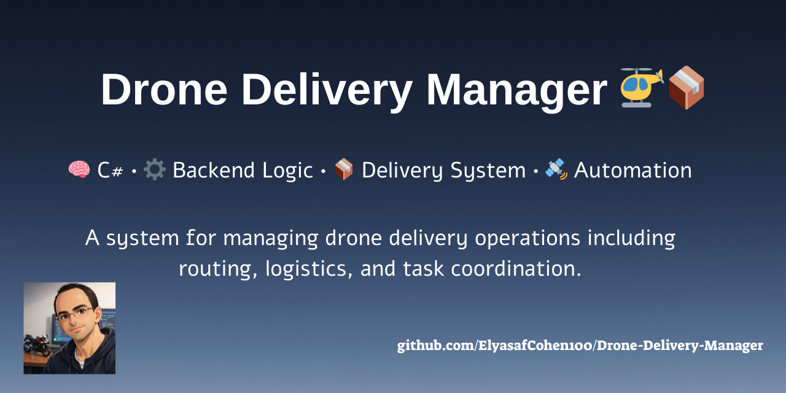

  

# 🚁 Drone Delivery Manager – .NET 🚁  

> **Mini Project | Windows Systems Engineering**  
> A full management system for a drone-based delivery company

---

## 🏷️ Technologies & Tools 

### 🖥️ Frontend 🖥️

### ⚙️ Backend & Core ⚙️

### 💾 Data & Infrastructure 💾

### 🔄 Runtime & Simulation 🔄

---

## ✨ Overview ✨

**Drone Delivery Manager** is a desktop application designed to manage a drone delivery company.  

The system supports full management of drones, parcels, customers, and base stations, including a **live drone simulator**.

The project was developed as part of a **Windows Systems Engineering mini project**, with a strong focus on clean architecture, separation of concerns, and proper design patterns.

---

## 🧱 System Architecture 🧱

The project is built using a **3-Layer Architecture**:

- 📁 Presentation Layer (WPF)
- 📁 Business Logic Layer (BL)
- 📁 Data Access Layer (DAL)

### 🔹 Presentation Layer (WPF)
- Graphical user interface
- Two separate interfaces:
  - 👤 **Customer UI**
  - 🛠️ **Admin / Manager UI**

### 🔹 Business Logic Layer (BL)
- Handles all business rules
- Manages drones, parcels, customers, and base stations
- Controls the drone life-cycle simulation

### 🔹 Data Access Layer (DAL)
The DAL is implemented in **two different ways**:

1. **In-Memory Lists**  
   - Data is stored in memory only  
   - All data is lost when the application is closed

2. **XML-Based Storage**  
   - Data is stored persistently in XML files  
   - Data is preserved between application runs

---

## 🏭 Factory Design Pattern 🏭

The system uses the **Factory Design Pattern** to control which DAL implementation is active.

### 🔄 Switching DAL Implementation
1. Open the file:
dal-config.xml

2. Change the **third line** to the desired DAL implementation
3. Restart the application

No code changes are required ✔️

---

## 🪴 User Interfaces 🪴

### 👥 Customer Interface
- View personal parcels 📦
- Create new parcels for delivery 📦

### 🛠️ Admin / Manager Interface
- View and manage:
- 🚁 Drones
- 🧍 Customers
- 🏢 Base Stations
- 📦 Parcels
- Display extended details for each entity
- Run the drone simulator

---

## 🎮 Drone Simulator 🎮

The project includes a **drone life-cycle simulator** that simulates real-world drone behavior.

### ▶️ How to Run the Simulator
1. Log in as **Admin** 🤵
2. Open **Drone List** 📝
3. Select a drone (double click) 🚁
4. Click the **Simulator** button 😇

🌱 The simulator runs using `BackgroundWorker` for smooth UI performance. 🌱

---

## 🔄 XML DAL – Important Note

For smooth usage of the XML-based DAL implementation:

1. Click the **Reset** button on the main window 🔘
2. Close the application 🔒
3. Restart the project 🔄

This prevents data conflicts and ensures clean initialization. 🧴🫧

---

## 🔐 Login Credentials 🔐

### 👤 Customers
- Username: `customer0`, `customer1`, ...
- Password: same as the username

### 🛠️ Admin
- Username: `admin`
- Password: `admin`

### ⚡ VIP Mode
- The **VIP** button allows login without credentials  
- Intended for debugging and development purposes

---

## 🧑‍💻 Contributors 🧑‍💻

- **Yakir Yohanan** 🤘😌 
- **Elyasaf Cohen** 👊😎

  

---

## 💥 Final Notes 💥

This project demonstrates:
- Clean architecture  
- Strong separation of concerns  
- Proper use of design patterns  
- Practical simulation of real-world delivery systems  

---

> ✨ If you like this project – please leave a star! ✨
